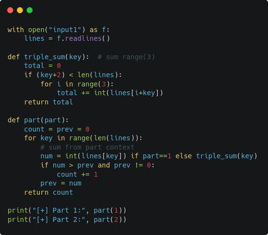
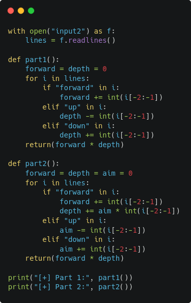
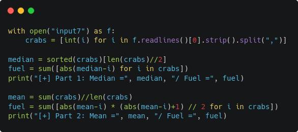

# Advent of Code 2021 (Python)

[Advent of Code](https://adventofcode.com/) provides programming puzzle challenges through December. The daily solution attempts along with the provided inputs will be uploaded in each day folder.

## Day 1: Sonar Sweep



## Day 2: Dive!



## Day 3: Binary Diagnostic

~~Requires refactoring to use a bitmask filter. Currently requires to manually check if last "filtered" numbers in CO2 exist in input.~~

## Day 4: Giant Squid (Bingo)

Result is being thrown as an exit code in an exception block due to reusing code from Part 1 without refactoring (recursively plays games until there are no more boards left).
If it works it works.


## Day 5: Hydrotermal Venture

The pillow Python module is required to create these sweet heatmaps for the vents. Install with `pip install pillow`.


## Day 6: Lanternfish

The change of state in each lanternfish cycle share some similarities to a primitive [LFSR](https://en.wikipedia.org/wiki/Linear-feedback_shift_register). They can be simplified as:

```
age[0] = age[1]
age[1] = age[2]
age[2] = age[3]
age[3] = age[4]
age[4] = age[5]
age[5] = age[6]
age[6] = age[7] + age[0]
age[7] = age[8]
age[8] = age[0]
```


## Day 7: The Treachery of Whales

Bruteforce solution also viable for Part 2 (check every possible position):

```python
fuel = pos = 0
for i in range(max(crabs)):
    tmp = 0
    for j in crabs:
        dif = abs(i - j)
        tmp += dif * (dif+1) // 2
    if tmp < fuel or fuel == 0:
        fuel = tmp
        pos = i
print("[+] Position =", pos, "/ Fuel =", fuel)
```


## Day 8: Seven Segment Search

Deduction rules via character repetitions in display and known character lengths in (1,4,7,8):

Repetitions | In known | Rule
------------|----------|-------------------------
a = 8       | 7, 8     | only in 7,8 (not in 1,4)
b = 6       | 4, 8     | 6 times
c = 8       | 1,4,7,8  | 8 times AND not A
d = 7       | 4, 8     | 7 times AND not G
e = 4       | 8        | 4 times
f = 9       | 1,4,7,8  | 9 times
g = 7       | 8        | 7 times AND only in 8 (not in 1,4,7)

## Day 9: Smoke Basin
