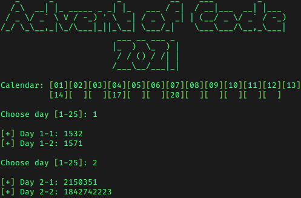
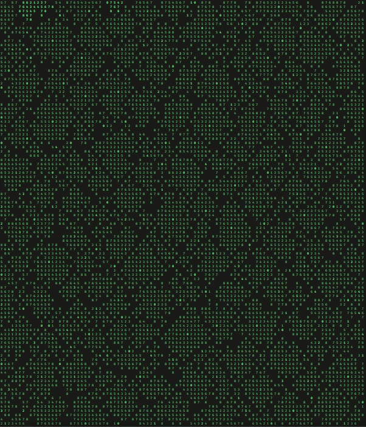

# Advent of Code 2021 (Python)

[Advent of Code](https://adventofcode.com/) provides programming puzzle challenges through December. The daily solution attempts along with the provided inputs will be uploaded in each day folder. Also added a neat menu as launcher:



<h4><details>
  <summary>Expand table contents</summary>

Day | Name | Solution
:---:|:---:|:---:
[01](#day-1-sonar-sweep) | Sonar Sweep | [File](advent1/advent1.py)
[02](#day-2-dive) | Dive! | [File](advent2/advent2.py)
[03](#day-3-binary-diagnostic) | Binary Diagnostic | [File](advent3/advent3.py)
[04](#day-4-giant-squid-bingo) | Giant Squid | [Bingo](advent4/advent4.py)
[05](#day-5-hydrotermal-venture) | Hydrotermal Venture | [File](advent5/advent5.py)
[06](#day-6-lanternfish) | Lanternfish | [File](advent6/advent6.py)
[07](#day-7-the-treachery-of-whales-crabs) | The Treachery of Whales | [Crabs](advent7/advent7.py)
[08](#day-8-seven-segment-search) | Seven Segment Search | [File](advent8/advent8.py)
[09](#day-9-smoke-basin) | Smoke Basin | [File](advent9/advent9.py)
[10](#day-10-syntax-scoring) | Syntax Scoring | [File](advent10/advent10.py)
[11](#day-11-dumbo-octopus) | Dumbo Octopus | [File](advent11/advent11.py)
[12](#day-12-passage-pathing) | Passage Pathing | [File](advent12/advent12.py)

</details></h4>

---
</br>

## Day 1: [Sonar Sweep](advent1/advent1.py)

<h4><details>
  <summary>Show code</summary>

```python
with open("input1") as f:
    lines = f.readlines()

def triple_sum(key):  # sum range(3)
    total = 0
    if (key+2) < len(lines):
        for i in range(3):
            total += int(lines[i+key])
    return total

def part(part):
    count = prev = 0
    for key in range(len(lines)):
        # sum from part context
        num = int(lines[key]) if part==1 else triple_sum(key)
        if num > prev and prev != 0:
            count += 1
        prev = num
    return count

print("[+] Part 1:", part(1))
print("[+] Part 2:", part(2))
```
</details></h4>
</br>

## Day 2: [Dive!](advent2/advent2.py)

<h4><details>
  <summary>Show code</summary>
  
```python
with open("input2") as f:
    lines = f.readlines()

def part1():
    forward = depth = 0
    for i in lines:
        if "forward" in i:
            forward += int(i[-2:-1])
        elif "up" in i:
            depth -= int(i[-2:-1])
        elif "down" in i:
            depth += int(i[-2:-1])
    return(forward * depth)

def part2():
    forward = depth = aim = 0
    for i in lines:
        if "forward" in i:
            forward += int(i[-2:-1])
            depth += aim * int(i[-2:-1])
        elif "up" in i:
            aim -= int(i[-2:-1])
        elif "down" in i:
            aim += int(i[-2:-1])
    return(forward * depth)

print("[+] Part 1:", part1())
print("[+] Part 2:", part2())
```
</details></h4>
</br>

## ~~Day 3: [Binary Diagnostic](advent3/advent3.py)~~

**\[ ! \]** Requires refactoring to use a bitmask filter. Currently requires to manually check if last "filtered" numbers in CO2 exist in input.
</br></br>

## Day 4: [Giant Squid](advent4/advent4.py) (Bingo)

Result is being thrown as an exit code in an exception block due to reusing code from Part 1 without refactoring (recursively plays games until there are no more boards left).
If it works it works.


</br></br>

## Day 5: [Hydrotermal Venture](advent5/advent5.py)

`pillow` module required to create these sweet heatmaps for the vents. Install with `pip install pillow`.


</br></br>

## Day 6: [Lanternfish](advent6/advent6.py)

The change of state in each lanternfish cycle share some similarities to a primitive [LFSR](https://en.wikipedia.org/wiki/Linear-feedback_shift_register). They can be simplified as:

```
age[0] = age[1]
age[1] = age[2]
age[2] = age[3]
age[3] = age[4]
age[4] = age[5]
age[5] = age[6]
age[6] = age[7] + age[0]
age[7] = age[8]
age[8] = age[0]
```

<h4><details>
  <summary>Show code (minimal output)</summary>

```python
with open("input6") as f:
    lines = f.readlines() 
fish = lines[0].strip().split(",")

def reset_age():
    age = [0]*9
    for i in range(len(fish)):
        age[int(fish[i])] += 1
    return age

def timeline(days):
    age = reset_age()
    for i in range(1,days+1):
        aux = age[0]
        for j in range(len(age)):
            if j != 8:
                age[j] = age[j+1]
        age[6] += aux
        age[8] = aux
        
        count = 0
        for k in range(len(age)):
            count += age[k]
    
    return count
    
part1 = timeline(80)
part2 = timeline(256)
print("[+] Day 80 =", part1)
print("[+] Day 256 =", part2)
```
</details></h4>
</br>


</br></br>

## Day 7: [The Treachery of Whales](advent7/advent7.py) (Crabs)

Bruteforce also viable for Part 2 (check every possible position):

<h4><details>
  <summary>Bruteforce function</summary>

```python
fuel = pos = 0
for i in range(max(crabs)):
    tmp = 0
    for j in crabs:
        dif = abs(i - j)
        tmp += dif * (dif+1) // 2
    if tmp < fuel or fuel == 0:
        fuel = tmp
        pos = i
print("[+] Position =", pos, "/ Fuel =", fuel)
```
</details></h4>

<h4><details>
  <summary>Optimized solution</summary>

```python
with open("input7") as f:
    crabs = [int(i) for i in f.readlines()[0].strip().split(",")]

median = sorted(crabs)[len(crabs)//2]
fuel = sum([abs(median-i) for i in crabs])
print("[+] Part 1: Median =", median, "/ Fuel =", fuel)

mean = sum(crabs)//len(crabs)
fuel = sum([abs(mean-i) * (abs(mean-i)+1) // 2 for i in crabs])
print("[+] Part 2: Mean =", mean, "/ Fuel =", fuel)
```
</details></h4>
</br>

## Day 8: [Seven Segment Search](advent8/advent8.py)

Deduction rules via character repetitions in display and known character lengths in (1,4,7,8):

Repetitions | In known | Rule
------------|----------|-------------------------
a = 8       | 7, 8     | only in 7,8 (not in 1,4)
b = 6       | 4, 8     | 6 times
c = 8       | 1,4,7,8  | 8 times AND not A
d = 7       | 4, 8     | 7 times AND not G
e = 4       | 8        | 4 times
f = 9       | 1,4,7,8  | 9 times
g = 7       | 8        | 7 times AND only in 8 (not in 1,4,7)
</br>

## Day 9: [Smoke Basin](advent9/advent9.py)

Relevant [Flood fill](https://en.wikipedia.org/wiki/Flood_fill) function code that recursively checks neighbouring cells from lowest points:

<h4><details>
  <summary>Show code</summary>

```python
def check(x,y,part):
    global size; height = 0
    
    c = mat[x][y]   # current position
    d = {           # direction (x,y) modifier
        "up"    : (-1,0) if x > 0 else (0,0),
        "down"  : (+1,0) if x < len(mat)-1 else (0,0),
        "left"  : (0,-1) if y > 0 else (0,0),
        "right" : (0,+1) if y < len(mat[0])-1 else (0,0)
    }
    
    if part == 1:  # check directions
        if all(c <= mat[x + d[i][0]][y + d[i][1]] for i in d):
            height += c+1
            lows.append((x,y))
            visited.append((x,y))
        return height
    
    elif part == 2:  # check recursively if not visited
        for i in d:
            xn = x + d[i][0]; yn = y + d[i][1]
            if (xn,yn) not in visited and mat[xn][yn] != 9:
                size += 1
                visited.append((xn,yn))
                check(xn,yn,2)
```
</details></h4>
</br>

Unoptimized `curses` visualization added as an afterthought:


</br></br>

## Day 10: [Syntax Scoring](advent10/advent10.py)

<h4><details>
  <summary>Show code (minimal output)</summary>

```python
with open("input10") as f:
    lines = [l.strip() for l in f.readlines()]

op = { "(":")", "[":"]", "{":"}", "<":">" }
ed = { ")":"(", "]":"[", "}":"{", ">":"<" }
points = { ")":(3,1), "]":(57,2), "}":(1197,3), ">":(25137,4) }

p1 = 0
p2 = []

for l in lines:
    queue = []
    corrupt = False
    for c in l:
        if c in op:
            queue.append(c)  # add open brackets to queue
        else:
            if queue[-1] == ed[c]:
                queue.pop()  # remove bracket if closed
            else:
                corrupt = True
                p1 += points[c][0]
                break
    
    if not corrupt:  # part 2
        complete = []
        score = 0
        # reverse queue and translate into closed bracket
        for c in reversed(queue):
            complete.append(op[c])
            score = (score*5) + points[complete[-1]][1]
        p2.append(score)
     
print("[+] Part 1 Result: ", p1)
result = sorted(p2)[len(p2)//2]
print("[+] Part 2 Result: ", result)
```
</details></h4>
</br>

## Day 11: [Dumbo Octopus](advent11/advent11.py)

`curses` visualization:


</br></br>

## Day 12: [Passage Pathing](advent12/advent12.py)

Unoptimized [DFS](https://en.wikipedia.org/wiki/Depth-first_search) algorithm for graph traversal (takes around 3 minutes for Part 2). This was the first day I had to seek some tips as to how to proceed, so props to the [AoC subreddit](https://www.reddit.com/r/adventofcode/).

<h4><details>
  <summary>Show code (minimal output)</summary>

```python
with open("input") as f:
    lines = f.readlines()

graph = {}  # adjacency list -> { a: [b,c], b: [a,c] }
for l in lines:
    x,y = l.strip().split("-")
    graph[x] = [y] if x not in graph else graph[x] + [y]
    graph[y] = [x] if y not in graph else graph[y] + [x]

# call recursively with a copy of visited paths to branch itself
def search(node, visited, part, twice=False):
    global paths
    visited += [node]
    if node == "end":  # add path and return
        if visited not in paths:
            paths += [visited]
        return
    
    for neighbour in graph[node]:  # check adjacent nodes
        if neighbour.isupper() or neighbour not in visited:
            search(neighbour, visited.copy(), part, twice)
            
        if part==2:  # visit lowercase twice if flag isn't set yet
            if neighbour.islower() and not twice and neighbour != "start":
                search(neighbour, visited.copy(), part, True)

paths = []
search("start", [], 1)
print("[+] Part 1 Result: ", len(paths))
paths = []
search("start", [], 2)
print("[+] Part 2 Result : ", len(paths))
```
</details></h4>
</br>
